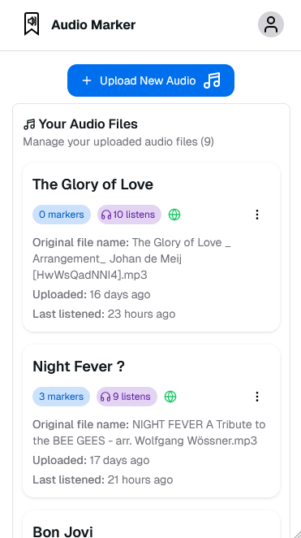
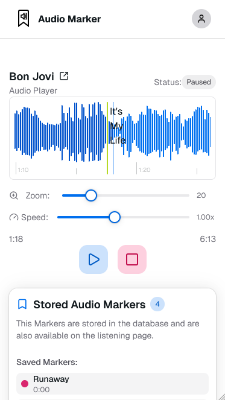
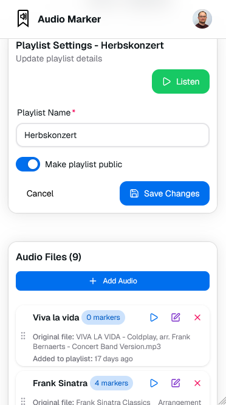

# Audio Marker

<div align="center">


**A powerful audio annotation and marker application for collaborative audio analysis**

[](LICENSE)
[](package.json)
[](https://nextjs.org/)
[](https://www.typescriptlang.org/)
[](./docker/)
[](https://github.com/danielraab/AudioMarker/actions)

Live Demo (comming soon) • [Report Bug](https://github.com/danielraab/AudioMarker/issues) • [Request Feature](https://github.com/danielraab/AudioMarker/issues)

</div>

---

## 📋 Table of Contents

- [About](#about)
- [Features](#features)
- [Tech Stack](#tech-stack)
- [Getting Started](#getting-started)
- [Docker Deployment](#docker-deployment)
- [Admin User Management](#admin-user-management)
- [Development](#development)
- [Contributing](#contributing)
- [License](#license)

## 🎯 About

Audio Marker is a modern web application designed for audio annotation and collaborative analysis. Whether you're transcribing interviews, analyzing music, or marking important moments in podcasts, Audio Marker provides an intuitive interface for time-based annotation of audio files.

Built with the [T3 Stack](https://create.t3.gg/), it combines type-safety, modern React patterns, and a robust backend infrastructure.

## ✨ Features

### 🎵 Audio Management
- **Upload & Store**: Upload audio files with automatic storage and metadata management
- **Smart Organization**: Manage your audio library with soft-delete functionality and easy restoration
- **Listen Statistics**: Track play counts and last listen timestamps for all audio files
- **File Format Support**: Compatible with common audio formats (MP3, WAV, OGG, etc.)



### 📍 Time-Based Markers
- **Precision Marking**: Add markers at specific timestamps in your audio files
- **Section Support**: Create sections with start and end times, or point markers for single moments
- **Region Selection**: Drag on waveform to select regions and automatically create sections
- **Auto-Loop Sections**: Sections automatically loop when clicked for focused listening
- **Custom Labels**: Give each marker a descriptive label for easy reference
- **Color Coding**: Organize markers with customizable colors for visual categorization
- **Visual Timeline**: Interactive waveform visualization powered by [WaveSurfer.js](https://wavesurfer.xyz/)
- **Browser Markers**: Listeners can create local markers without an account
- **Marker Management**: Edit, delete, and reorder markers with ease



### 📝 Playlist Creation
- **Organize Content**: Group related audio files into playlists
- **Drag & Drop**: Reorder audio files within playlists using intuitive drag-and-drop
- **Sequential Playback**: Automatically play through playlist items in order
- **Playlist Statistics**: Track listen counts for entire playlists
- **Public/Private Sharing**: Control playlist visibility



### 🔐 User Authentication & Authorization
- **Secure Login**: Authentication powered by NextAuth.js
- **Multiple Providers**: Support for email (magic links) and OAuth providers
- **Role-Based Access**: Admin and regular user roles with appropriate permissions
- **User Management**: Admins can manage users, enable/disable accounts
- **Privacy Controls**: Set audio files and playlists as public or private

### ⚖️ Legal & Compliance
- **Privacy Policy**: Comprehensive privacy policy covering GDPR and CCPA requirements
- **Terms of Service**: Clear terms outlining user responsibilities and acceptable use
- **DMCA Compliance**: Built-in DMCA takedown process for copyright protection
- **Cookie Consent**: GDPR-compliant cookie consent banner
- **Data Rights**: User rights management (access, deletion, data portability)

### 🌐 Sharing & Collaboration
- **Public/Private Toggle**: Share audio files and playlists publicly or keep them private
- **Direct Links**: Share specific audio files or playlists via URL
- **Embed Ready**: Clean public interface for shared content
- **Access Control**: Owner-only editing with public viewing when shared

### 🌍 Internationalization
- **Multi-Language Support**: Built-in i18n with English and German translations
- **Easy Extension**: Add new languages with simple JSON configuration
- **User Preferences**: Language selection per user session

### 📱 Progressive Web App (PWA)
- **Installable**: Add to home screen on mobile and desktop
- **Offline Ready**: Service worker for improved performance and offline capabilities
- **Responsive Design**: Optimized for mobile, tablet, and desktop viewing
- **Modern UI**: Beautiful interface built with Hero UI and Tailwind CSS

### 🔧 Developer Features
- **Type-Safe API**: End-to-end type safety with tRPC
- **Database Management**: Prisma ORM with SQLite (easily swappable to PostgreSQL/MySQL)
- **Error Tracking**: Integrated Sentry for production error monitoring
- **Docker Support**: Complete containerization with docker-compose
- **CI/CD Ready**: GitHub Actions workflows for automated builds and deployment
- **Health Checks**: Built-in health check endpoint for monitoring

## 🛠 Tech Stack

**Frontend:**
- [Next.js 15](https://nextjs.org/) - React framework with App Router
- [React 19](https://react.dev/) - UI library
- [TypeScript](https://www.typescriptlang.org/) - Type safety
- [Tailwind CSS](https://tailwindcss.com/) - Utility-first CSS
- [Hero UI](https://www.heroui.com/) - React component library
- [WaveSurfer.js](https://wavesurfer.xyz/) - Audio waveform visualization
- [Framer Motion](https://www.framer.com/motion/) - Animation library
- [Lucide React](https://lucide.dev/) - Icon library

**Backend:**
- [tRPC](https://trpc.io/) - End-to-end typesafe APIs
- [Prisma](https://www.prisma.io/) - Next-generation ORM
- [NextAuth.js](https://next-auth.js.org/) - Authentication
- [Zod](https://zod.dev/) - Schema validation

**Infrastructure:**
- [Docker](https://www.docker.com/) - Containerization
- [SQLite](https://www.sqlite.org/) - Database (development)
- [Sentry](https://sentry.io/) - Error tracking
- [GitHub Actions](https://github.com/features/actions) - CI/CD

## 🚀 Getting Started

### Prerequisites

- Node.js 20.x or higher
- npm 10.x or higher
- A database (SQLite by default, or PostgreSQL/MySQL)

### Installation

1. **Clone the repository**
   ```bash
   git clone https://github.com/danielraab/AudioMarker.git
   cd AudioMarker
   ```

2. **Install dependencies**
   ```bash
   npm install
   ```

3. **Set up environment variables**
   
   Create a `.env` file in the root directory. Use the `.env.example` as a template.

4. **Initialize the database**
   ```bash
   npm run db:push
   ```

5. **Create an admin user**
   ```bash
   npm run admin:create your-email@example.com
   ```

6. **Start the development server**
   ```bash
   npm run dev
   ```

7. **Open your browser**
   
   Navigate to [http://localhost:3000](http://localhost:3000)

### Quick Start Scripts

```bash
# Development
npm run dev              # Start development server with Turbopack
npm run db:studio        # Open Prisma Studio to view/edit data
npm run lint             # Run ESLint
npm run typecheck        # Run TypeScript type checking

# Production
npm run build            # Build for production
npm run start            # Start production server

# Database
npm run db:push          # Push schema changes to database
npm run db:generate      # Run Prisma migrations
npm run db:migrate       # Deploy migrations to production
```

## 🐳 Docker Deployment

This project includes Docker support and automated CI/CD pipelines. All Docker-related files are located in the [`docker/`](docker/) directory.

### Quick Start with Docker

```bash
# Using docker-compose (recommended)
docker-compose -f docker/docker-compose.yml up -d

# Or build and run manually
docker build -f docker/Dockerfile -t audio-marker .
docker run -p 3000:3000 audio-marker
```

### Automated Docker Builds

The project includes GitHub Actions workflows that automatically build and push Docker images:

- **GitHub Container Registry**: Automatically builds on push to main/develop branches
- **Docker Hub**: Optional workflow for Docker Hub deployment

For detailed setup instructions, see [Docker Documentation](./docker/README.Docker.md).

### Production Deployment

For production deployments, make sure to:
- Use a proper database (PostgreSQL recommended)
- Set appropriate environment variables
- Configure reverse proxy (nginx recommended)
- Enable HTTPS/SSL
- Set up proper backup strategies

### Known Issues

#### File Upload Problem with nginx

Add the following nginx configuration to solve upload issues:

```nginx
client_max_body_size 50M;
proxy_request_buffering off;
proxy_buffering off;
```

## 👤 Admin User Management

Create or promote users to admin status using the CLI command:

```bash
# Development
npm run admin:create <email>

# Production (standalone)
npx tsx scripts/create-admin.ts <email>

# Production (Docker)
docker exec -it <container-name> npm run admin:create <email>
```

Example:
```bash
# Development
npm run admin:create admin@example.com

# Docker
docker exec -it audio-marker npm run admin:create admin@example.com
```

For more details, see [scripts/README.md](scripts/README.md).

## 💻 Development

### Development Workflow

```bash
# Install dependencies
npm install

# Set up the database
npm run db:push

# Start development server with hot reload
npm run dev
```

### Code Quality

```bash
# Lint code
npm run lint
npm run lint:fix          # Auto-fix linting issues

# Format code
npm run format:check
npm run format:write      # Auto-format code

# Type checking
npm run typecheck

# Run all checks
npm run check             # Runs lint + typecheck
```

### Database Management

```bash
# Open Prisma Studio (visual database editor)
npm run db:studio

# Push schema changes to database
npm run db:push

# Create a new migration
npm run db:generate

# Apply migrations
npm run db:migrate
```

## 🤝 Contributing

Contributions are welcome! Please feel free to submit a Pull Request. For major changes, please open an issue first to discuss what you would like to change.

1. Fork the repository
2. Create your feature branch (`git checkout -b feature/AmazingFeature`)
3. Commit your changes (`git commit -m 'Add some AmazingFeature'`)
4. Push to the branch (`git push origin feature/AmazingFeature`)
5. Open a Pull Request

Please make sure to:
- Create/Update tests as appropriate
- Follow the existing code style
- Run `npm run check` before committing
- Update documentation for any new features

## 📄 License

This project is licensed under the MIT License - see the [LICENSE](LICENSE) file for details.

## 🙏 Acknowledgments

- Built with the [T3 Stack](https://create.t3.gg/)
- Inspired by the need for better audio annotation tools
- Thanks to all contributors and users

## 📞 Support

- 🐛 Bug Reports: [GitHub Issues](https://github.com/danielraab/AudioMarker/issues)
- 💬 Discussions: [GitHub Discussions](https://github.com/danielraab/AudioMarker/discussions)

## 🗺️ Roadmap

- [ ] allow more audio file types
- [ ] Add description field for audio, playlist and markers
- [ ] Add Regions (like markers with start and end, with possible loopplay)
- [ ] Filter or load more button with for the audios on the dashboard incl search functionallity 
- [ ] Make existing markers editable
- [ ] Save shared audio and playlist listen links (only if logged in)
- [ ] Share audio files in edit mode (to logged in only)
- [ ] Share playlist files in edit mode (to logged in only)
- [ ] auto play for playlists in listen mode
- [ ] Export and import browser markers
- [ ] Listen statistics chart

---

<div align="center">

[⬆ Back to Top](#audio-marker)

</div>
